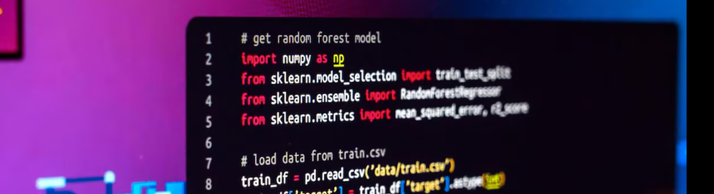

  

 

## 🖖 Olá, meu nome é <strong>Marcos Paulo!</strong>

<h3>
  Conhecido também como <strong>Smiith</strong>, sou apaixonado por tecnologia,
  programação, automação e desenvolvimento de soluções.
</h3>

- 💻 Explorando novas tecnologias e desenvolvendo projetos
- 🎓 Formado em **Análise e Desenvolvimento de Sistemas** pela <a href="https://www.unip.br">UNIP</a>
- 💼 Atualmente atuando como **Desenvolvedor Júnior**
- 🤖 Automações e soluções de **IA com n8n e Python**
- 🎨 Desenvolvimento **Frontend**
- 🔗 Integrações e desenvolvimento de **APIs**

## 🚀 Minhas Skills

  

## 💻 Desenvolvimento

  

## 🧰 Ferramentas que utilizo

  

## ☁️ Cloud, Infraestrutura & Deploy

  

### 📊 Estatísticas

  <picture>
    <source media="(prefers-color-scheme: dark)"  srcset="./assets/stats.svg">
    <source media="(prefers-color-scheme: light)" srcset="./assets/stats-light.svg">
    
  </picture>

  <picture>
    <source media="(prefers-color-scheme: dark)"  srcset="./assets/donut.svg">
    <source media="(prefers-color-scheme: light)" srcset="./assets/donut-light.svg">
    
  </picture>

Feito com <a href="https://github.com/OwSmiithDev/gh-gadgets">GH-Gadgets</a>.

 

## 🌐 Conecte-se comigo

  
  &nbsp;&nbsp;&nbsp;
  
  &nbsp;&nbsp;&nbsp;
  

