## 🖖 Olá, meu nome é <strong>Marcos Paulo!</strong>
<h3> Conhecido também como Smiith, sou Amante da tecnologia e da programação!</h3>

- 💻 Iniciando nas novas tecnologias e desenvolvendo projetos.
- 🎓 Formado em **Análise e Desenvolvimento de Sistemas** pela <a href="https://www.unip.br">UNIP</a>.
- 💼 Atualmente **Desenvolvedor Júnior**
- 💻 Analista em **Automações IA com n8n e Python**
- 💻 Frontend's com vida!
- 🛠️ Integrações com API's

## 🚀 Minhas Skills (Aprendendo)

  

## 🛠️Ferramentas que uso

  

## 🛠️Ferramentas de desenvolvimento

  

### 📊 Estatísticas

  <picture>
    <source media="(prefers-color-scheme: dark)"  srcset="./assets/donut.svg">
    <source media="(prefers-color-scheme: light)" srcset="./assets/donut-light.svg">
    
  </picture>
  <picture>
    <source media="(prefers-color-scheme: dark)"  srcset="./assets/stats.svg">
    <source media="(prefers-color-scheme: light)" srcset="./assets/stats-light.svg">
    
  </picture>

  <picture>
    <source media="(prefers-color-scheme: dark)"  srcset="./assets/langs.svg">
    <source media="(prefers-color-scheme: light)" srcset="./assets/langs-light.svg">
    
  </picture>

Gerados duas vezes por dia por um
<a href="https://github.com/OwSmiithDev/OwSmiithDev/actions">GitHub Action</a> e
commitados neste repositório — imagem externa passaria pelo proxy <code>camo</code>,
que cacheia por conta própria e deixaria os números velhos por horas.
Feito com <a href="https://github.com/OwSmiithDev/gh-gadgets">gh-gadgets</a>.

 

### 📱 Minhas redes:

  

  

